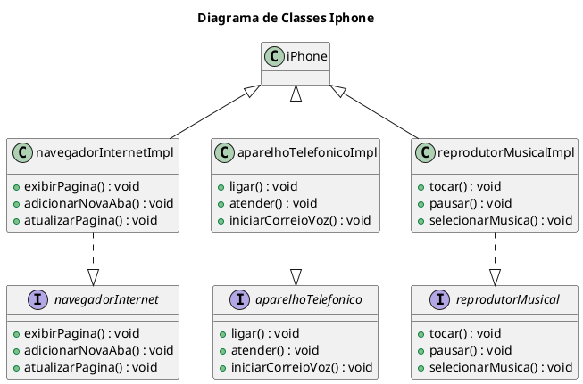

# diagrama-iphone
Desafio de Projeto do Bootcamp Desenvolvimento Java com Cloud AWS, fornecido pela [DIO](https://web.dio.me/), o qual envolve a criação de um diagrama de classes UML básico de alguns componentes do iPhone.

